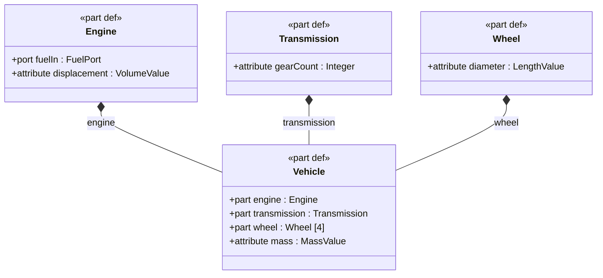
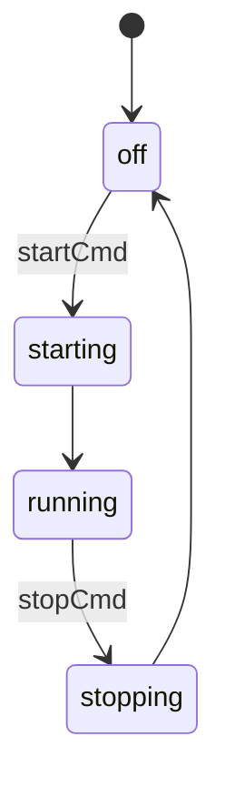

# sysml

A fast, standalone SysML v2 command-line toolchain and language server for model authoring, validation, simulation, and diagram generation.

Built on [tree-sitter](https://tree-sitter.github.io/) for reliable parsing of SysML v2 textual notation. Zero runtime dependencies — just a single binary.

## Documentation

| | |
|---|---|
| [Tutorial](docs/tutorial.md) | Build a weather station model from scratch using the CLI |
| [Validation & Diagnostics](docs/validation.md) | 12 lint checks, diagnostic codes, output formats |
| [Architecture](docs/architecture.md) | Crate structure, design decisions, 3-crate workspace |
| [CI & Editor Integration](docs/ci-integration.md) | GitHub Actions workflow, LSP setup, Emacs sysml2-mode, JSON output |
| **Command references** | [Analysis](docs/commands/analysis.md) &#183; [Diagrams](docs/commands/diagrams.md) &#183; [Editing](docs/commands/editing.md) &#183; [Simulation](docs/commands/simulation.md) &#183; [Project](docs/commands/project.md) |

## Installation

### From source

```sh
git clone --recurse-submodules https://github.com/jackhale98/sysml-cli.git
cd sysml-cli
cargo install --path crates/sysml-cli
```

Or build manually:

```sh
cargo build --release
cp target/release/sysml ~/.local/bin/
```

The build compiles the [tree-sitter-sysml](https://github.com/jackhale98/tree-sitter-sysml) grammar from source (included as a submodule). Requires Rust 1.70+ and a C compiler (gcc or clang).

### Language server (LSP)

The `sysml-lsp` binary is a full-featured language server for SysML v2 with 17 capabilities: diagnostics, go-to-definition, find references, hover (with rollup values), contextual completions, document outline, workspace symbols, semantic highlighting, code actions (quick-fix + add import), formatting, document highlight, folding, rename, type hierarchy, and inlay hints.

```sh
cargo install --path crates/sysml-lsp
```

Or download a prebuilt binary from [GitHub Releases](https://github.com/jackhale98/sysml-cli/releases). See [CI & Editor Integration](docs/ci-integration.md) for VS Code, Neovim, Helix, and Zed setup.

### Shell completions

```sh
sysml completions bash > ~/.local/share/bash-completion/completions/sysml
sysml completions zsh > ~/.zfunc/_sysml
sysml completions fish > ~/.config/fish/completions/sysml.fish
```

## Quick Start

The primary way to use sysml is through its **interactive wizard**. No SysML syntax knowledge required:

```sh
sysml init                                      # Initialize a project
sysml add                                       # Launch interactive wizard
sysml add model.sysml                           # Wizard with model-aware suggestions
```

For automation and scripting, every operation has a flag-based equivalent:

```sh
sysml add model.sysml part-def Vehicle --doc "A passenger vehicle"
sysml add model.sysml part engine -t Engine --inside Vehicle
sysml add model.sysml connection c1 --connect "a.x to b.y" --inside Vehicle
sysml lint model.sysml
sysml diagram -t bdd model.sysml
sysml simulate sm model.sysml -n StationStates -e powerOn,startSensors
```

## Highlights

### Interactive model authoring — no SysML syntax required

`sysml add` launches a guided wizard. Pick what you're building, name it, and the tool generates valid SysML v2:

```
$ sysml add model.sysml
Available types: Sensor, Controller, Display, PowerSupply
? What are you creating? > Part definition (component type)
? Name: TemperatureSensor
? Brief description: Measures ambient temperature
? Extend another type? > Sensor
? Add members (comma-separated)? status:SensorStatus, range:Real

Preview:
  part def TemperatureSensor :> Sensor {
      doc /* Measures ambient temperature */
      attribute status : SensorStatus;
      attribute range : Real;
  }

Wrote TemperatureSensor to model.sysml
```

Power users skip the wizard: `sysml add model.sysml part-def TemperatureSensor --extends Sensor -m "attribute status:SensorStatus,attribute range:Real"`

### Full SysML generation — state machines, actions, constraints, calcs

Generate complete elements with internal structure, not just skeletons:

```sh
# State machine with states and transitions
sysml add model.sysml state-def EngineStates \
    -m "state off,state starting,state running" \
    -m "transition first off accept startCmd then starting" \
    -m "transition first starting then running"

# Action with steps and successions
sysml add model.sysml action-def ReadSensors \
    -m "action readTemp,action processData,action updateDisplay" \
    -m "first readTemp then processData" \
    -m "first processData then updateDisplay"

# Constraint with expression
sysml add model.sysml constraint-def TempLimit \
    -m "in attribute temp:Real" \
    -m "constraint temp >= -40 and temp <= 60"

# Calc with return type
sysml add model.sysml calc-def BatteryRuntime \
    -m "in attribute capacity:Real,in attribute consumption:Real" \
    -m "return hours:Real"

# Verification case with objective
sysml add model.sysml verification-def TestTempAccuracy \
    --doc "Verify temperature sensor accuracy" \
    -m "subject testSubject" \
    -m "requirement tempReq:TemperatureAccuracy"
```

### SysML v2 standard views, 4 output formats

Generate all 7 standard SysML v2 views (General, Interconnection, Action Flow, State Transition, Sequence, Grid, Browser) plus parametric, traceability, allocation, and use case — in Mermaid, PlantUML, DOT, or D2:

```sh
sysml diagram -t gv model.sysml                        # General View (definitions)
sysml diagram -t iv --scope Vehicle model.sysml         # Interconnection View (ports + connections)
sysml diagram -t stv --scope EngineStates model.sysml   # State Transition View
sysml diagram -t afv --scope ProvidePower model.sysml   # Action Flow View
sysml diagram -t sv --scope Interactions model.sysml    # Sequence View (lifelines + messages)
sysml diagram -t bv model.sysml                         # Browser View (package hierarchy)
sysml diagram -t grv model.sysml                        # Grid View (requirements matrix)
```

Legacy names still work: `bdd`=`gv`, `ibd`=`iv`, `stm`=`stv`, `act`=`afv`, `pkg`=`bv`, `req`=`grv`.

Definitions render with **square corners**, usages with **rounded corners** (SysML v2 graphical convention).

**Block Definition Diagram (BDD):**



**State Machine Diagram:**



### Simulate state machines and evaluate constraints

```sh
$ sysml simulate sm model.sysml -n EngineStates -e startCmd,stopCmd
State Machine: EngineStates
Initial state: off
  Step 0: off -- [startCmd]--> starting
  Step 1: starting --> running
  Step 2: running -- [stopCmd]--> stopping
  Step 3: stopping --> off

$ sysml simulate eval constraints.sysml -n PowerBudget -b consumption=450
constraint PowerBudget: satisfied
```

### Requirements traceability

```sh
$ sysml trace requirements.sysml model.sysml
Requirement          Satisfied By         Verified By
------------------------------------------------------------
TemperatureAccuracy  TemperatureSensor    TestTempAccuracy
OperatingRange       WeatherStationUnit   -
BatteryLife          PowerSupply          TestBatteryLife

Coverage: 3/3 satisfied (100%), 2/3 verified (67%)
```

### Attribute rollups — mass, cost, power, tolerance budgets

Compute any numeric attribute across the part hierarchy. Works for mass budgets, cost rollups, power budgets, tolerance stackups — anything with a numeric attribute:

```sh
$ sysml rollup compute model.sysml --root Vehicle --attr mass
Rollup: mass (sum) for Vehicle
  Vehicle                                   total: 900.0000
    (own)                                        20.0000
    engine : Engine       180.0000 => 180.0000 (20.0%)
    chassis : Chassis     250.0000 => 250.0000 (27.8%)
    wheels : Wheel [4]     12.5000 =>  50.0000 (5.6%)
    body : Body           400.0000 => 400.0000 (44.4%)

$ sysml rollup budget model.sysml --root Vehicle --attr mass --limit 1000
Budget: mass for Vehicle
  Total:  900.0000
  Limit:  1000.0000
  Margin: 100.0000 (10.0%)
  Status: PASS
```

Aggregation methods: `sum` (default), `rss` (tolerance stackups), `product`, `min`, `max`. Use `--format json` for CI integration.

Parametric sweeps and what-if scenarios:

```sh
$ sysml rollup sweep model.sysml --root Vehicle --attr mass --param engine --from 100 --to 300 --steps 5
$ sysml rollup what-if model.sysml --root Vehicle --attr mass -s "light:engine=100" -s "heavy:engine=300"
```

### Interactive REPL — explore models conversationally

`sysml repl` loads your project and lets you navigate, query, and analyze interactively:

```
sysml> cd Vehicle                          # Focus on Vehicle
sysml [Vehicle]> list                      # Show Vehicle's children
sysml [Vehicle]> usages type:Engine        # Find all Engine usages
sysml [Vehicle]> rollup mass               # Mass rollup from focused root
sysml [Vehicle]> typeof Wheel              # Where is Wheel used?
sysml [Vehicle]> subtypes                  # What specializes Vehicle?
sysml [Vehicle]> connections               # Connections involving Vehicle
sysml [Vehicle]> trace                     # Requirements traceability
sysml> usages in:Engine kind:port          # Combined filter
sysml> supertypes Sedan                    # Walk inheritance chain
```

### Analysis cases and trade studies

Execute SysML v2 analysis cases and compare alternatives:

```sh
sysml analyze list model.sysml
sysml analyze run model.sysml -n FuelEconomyAnalysis
sysml analyze trade model.sysml -n EngineTradeOff
```

### Semantic diff — compare models, not text

```sh
$ sysml diff model-v1.sysml model-v2.sysml
  Added:   part def RainGauge :> Sensor
  Removed: attribute maxSpeed in WindSensor
  Changed: TemperatureSensor.range_max (line 42 → 45)
```

### CI pipelines from config

```toml
[[pipeline]]
name = "ci"
steps = [
    "lint model.sysml requirements.sysml",
    "fmt --check model.sysml",
    "trace --check --min-coverage 80 requirements.sysml",
]
```

```sh
sysml pipeline run ci
```

### Global Options

| Flag | Description |
|------|-------------|
| `-f, --format <FORMAT>` | Output format: `text`, `json` (default: `text`) |
| `-q, --quiet` | Suppress summary line on stderr |
| `-I, --include <PATH>` | Additional files/directories for import resolution |
| `--stdlib-path <PATH>` | Path to the SysML v2 standard library directory (env: `SYSML_STDLIB_PATH`, config: `stdlib_path`) |

## Commands

| Command | Description | Docs |
|---------|-------------|------|
| **Editing** | | [editing](docs/commands/editing.md) |
| `add` | Add elements interactively, to a file, or to stdout | |
| `remove` (`rm`) | Remove an element from a SysML file | |
| `rename` | Rename an element and update all references (`--project` for cross-file) | |
| `fmt` | Format SysML v2 source files | |
| **Analysis** | | [analysis](docs/commands/analysis.md) |
| `check` | Validate models against 12 structural rules (also: `lint`) | |
| `list` (`ls`) | List model elements with filters | |
| `show` | Show detailed element information | |
| `trace` | Requirements traceability matrix | |
| `interfaces` | Analyze port interfaces and connections | |
| `find` | Search model elements by name pattern across project | |
| `deps` | Dependency analysis for an element (`--transitive` for chains) | |
| `diff` | Semantic diff between two SysML files | |
| `allocation` (`alloc`) | Logical-to-physical allocation matrix | |
| `coverage` | Model quality and completeness report | |
| `stats` | Aggregate model statistics | |
| **Rollups** | | |
| `rollup compute` | Aggregate any attribute over the part hierarchy (sum, RSS, min, max) | |
| `rollup budget` | Check a rollup total against a limit (CI gate) | |
| `rollup sensitivity` | Rank children by contribution to a rollup | |
| `rollup sweep` | Parametric sweep: evaluate rollup across a range of values | |
| `rollup what-if` | Compare rollup under different override scenarios | |
| `rollup query` | Find all instances of an attribute across the model | |
| **Analysis** | | |
| `analyze list` | List analysis cases in model files | |
| `analyze run` | Execute an analysis case with subject binding | |
| `analyze trade` | Compare alternatives in a trade study | |
| **Diagrams** | | [diagrams](docs/commands/diagrams.md) |
| `diagram` | Generate SysML v2 standard views: gv, iv, afv, stv, sv, grv, bv (+ par, trace, alloc, ucd) | |
| **Simulation & Export** | | [simulation](docs/commands/simulation.md) |
| `simulate` (`sim`) | Evaluate constraints, state machines, action flows | |
| `export` | Export FMI 3.0, Modelica, SSP artifacts | |
| **Project** | | [project](docs/commands/project.md) |
| `init` | Initialize a `.sysml/` project | |
| `index` | Build or rebuild project index | |
| `pipeline` | Run named validation pipelines from config | |
| `repl` | Interactive REPL with stateful navigation, relationship queries, and filtering | |
| `doc` | Generate Markdown documentation from model structure and comments | |
| `completions` | Generate shell completion scripts | |
| **Language Server** | | [editor setup](docs/ci-integration.md#language-server-sysml-lsp) |
| `sysml-lsp` | LSP server with 17 capabilities: diagnostics, go-to-def, references, hover (with rollups), contextual completions, outline, workspace symbols, semantic tokens, code actions, formatting, document highlight, folding, rename, type hierarchy, inlay hints | |

## License

GPL-3.0-or-later
