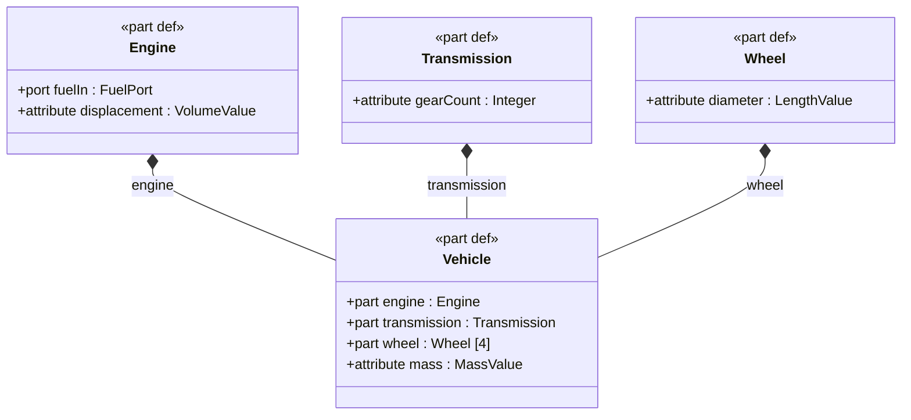
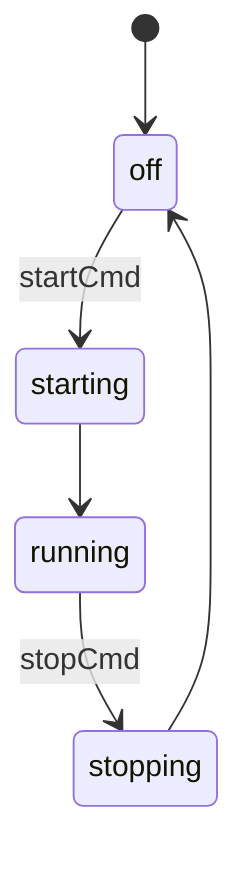

# sysml

A fast, standalone SysML v2 command-line toolchain for model authoring, validation, simulation, diagram generation, and full product lifecycle management.

Built on [tree-sitter](https://tree-sitter.github.io/) for reliable parsing of SysML v2 textual notation. Zero runtime dependencies — just a single binary.

## Documentation

| | |
|---|---|
| [Tutorial](docs/tutorial.md) | Build a weather station model from scratch using the CLI |
| [Validation & Diagnostics](docs/validation.md) | 9 lint checks, diagnostic codes, output formats |
| [Domain Libraries](docs/domain-libraries.md) | Base types for risk, tolerance, BOM, manufacturing, quality |
| [Architecture](docs/architecture.md) | Crate structure, design decisions, 12-crate workspace |
| [CI & Editor Integration](docs/ci-integration.md) | GitHub Actions workflow, Emacs sysml2-mode, JSON output |
| **Command references** | [Analysis](docs/commands/analysis.md) &#183; [Diagrams](docs/commands/diagrams.md) &#183; [Editing](docs/commands/editing.md) &#183; [Simulation](docs/commands/simulation.md) &#183; [Lifecycle](docs/commands/lifecycle.md) &#183; [Project](docs/commands/project.md) |

## Installation

### From source

```sh
git clone --recurse-submodules https://github.com/jackhale98/sysml-cli.git
cd sysml-cli
cargo install --path crates/sysml-cli
```

Or build manually:

```sh
cargo build --release
cp target/release/sysml ~/.local/bin/
```

The build compiles the [tree-sitter-sysml](https://github.com/jackhale98/tree-sitter-sysml) grammar from source (included as a submodule). Requires Rust 1.70+ and a C compiler (gcc or clang).

To enable the optional SQLite-backed persistent cache:

```sh
cargo install --path crates/sysml-cli --features sqlite
```

### Shell completions

```sh
sysml completions bash > ~/.local/share/bash-completion/completions/sysml
sysml completions zsh > ~/.zfunc/_sysml
sysml completions fish > ~/.config/fish/completions/sysml.fish
```

## Quick Start

The primary way to use sysml is through its **interactive wizard**. No SysML syntax knowledge required:

```sh
sysml init                                      # Initialize a project
sysml add                                       # Launch interactive wizard
sysml add model.sysml                           # Wizard with model-aware suggestions
```

For automation and scripting, every operation has a flag-based equivalent:

```sh
sysml add model.sysml part-def Vehicle --doc "A passenger vehicle"
sysml add model.sysml part engine -t Engine --inside Vehicle
sysml add model.sysml connection c1 --connect "a.x to b.y" --inside Vehicle
sysml lint model.sysml
sysml diagram -t bdd model.sysml
sysml simulate sm model.sysml -n StationStates -e powerOn,startSensors
```

## Highlights

### Interactive model authoring — no SysML syntax required

`sysml add` launches a guided wizard. Pick what you're building, name it, and the tool generates valid SysML v2:

```
$ sysml add model.sysml
Available types: Sensor, Controller, Display, PowerSupply
? What are you creating? > Part definition (component type)
? Name: TemperatureSensor
? Brief description: Measures ambient temperature
? Extend another type? > Sensor
? Add members (comma-separated)? status:SensorStatus, range:Real

Preview:
  part def TemperatureSensor :> Sensor {
      doc /* Measures ambient temperature */
      attribute status : SensorStatus;
      attribute range : Real;
  }

Wrote TemperatureSensor to model.sysml
```

Power users skip the wizard: `sysml add model.sysml part-def TemperatureSensor --extends Sensor -m "attribute status:SensorStatus,attribute range:Real"`

### Full SysML generation — state machines, actions, constraints, calcs

Generate complete elements with internal structure, not just skeletons:

```sh
# State machine with states and transitions
sysml add model.sysml state-def EngineStates \
    -m "state off,state starting,state running" \
    -m "transition first off accept startCmd then starting" \
    -m "transition first starting then running"

# Action with steps and successions
sysml add model.sysml action-def ReadSensors \
    -m "action readTemp,action processData,action updateDisplay" \
    -m "first readTemp then processData" \
    -m "first processData then updateDisplay"

# Constraint with expression
sysml add model.sysml constraint-def TempLimit \
    -m "in attribute temp:Real" \
    -m "constraint temp >= -40 and temp <= 60"

# Calc with return type
sysml add model.sysml calc-def BatteryRuntime \
    -m "in attribute capacity:Real,in attribute consumption:Real" \
    -m "return hours:Real"

# Verification case with objective
sysml add model.sysml verification-def TestTempAccuracy \
    --doc "Verify temperature sensor accuracy" \
    -m "subject testSubject" \
    -m "requirement tempReq:TemperatureAccuracy"
```

### 10 diagram types, 4 output formats

Generate BDD, IBD, state machine, activity, requirements, package, parametric, traceability, allocation, and use case diagrams — output as Mermaid, PlantUML, Graphviz DOT, or D2:

```sh
sysml diagram -t bdd model.sysml
sysml diagram -t ibd --scope Vehicle model.sysml
sysml diagram -t stm --scope EngineStates model.sysml
sysml diagram -t trace -o plantuml requirements.sysml
```

**Block Definition Diagram (BDD):**



**State Machine Diagram:**



### Simulate state machines and evaluate constraints

```sh
$ sysml simulate sm model.sysml -n EngineStates -e startCmd,stopCmd
State Machine: EngineStates
Initial state: off
  Step 0: off -- [startCmd]--> starting
  Step 1: starting --> running
  Step 2: running -- [stopCmd]--> stopping
  Step 3: stopping --> off

$ sysml simulate eval constraints.sysml -n PowerBudget -b consumption=450
constraint PowerBudget: satisfied
```

### Requirements traceability

```sh
$ sysml trace requirements.sysml model.sysml
Requirement          Satisfied By         Verified By
------------------------------------------------------------
TemperatureAccuracy  TemperatureSensor    TestTempAccuracy
OperatingRange       WeatherStationUnit   -
BatteryLife          PowerSupply          TestBatteryLife

Coverage: 3/3 satisfied (100%), 2/3 verified (67%)
```

### Full lifecycle in one tool

Risk matrices, FMEA, tolerance stack-ups, BOM rollups, supplier RFQs, verification execution, NCR/CAPA/Deviation tracking — all driven from SysML models with domain library types:

```sh
sysml risk add                                  # Interactive risk creation wizard
sysml risk matrix model.sysml                   # 5x5 severity/likelihood matrix
sysml risk fmea model.sysml                     # FMEA worksheet

sysml verify run verification.sysml             # Step-through test execution
sysml quality create --type ncr                 # NCR wizard → TOML record
sysml quality rca --source NCR-001 --method fishbone

sysml tol analyze model.sysml --method monte-carlo --iterations 50000
sysml bom rollup model.sysml --root Vehicle --include-mass --include-cost
sysml mfg start-lot model.sysml                # Start a production lot
sysml mfg step                                 # Execute next manufacturing step
```

All lifecycle records are written as TOML files to `.sysml/records/` for traceability.

### Manufacturing SPC and process capability

```sh
$ sysml mfg spc --parameter SensorCalibration --values 0.48,0.52,0.50,0.49,0.51,0.50,0.53,0.47
  Mean: 0.500  Std: 0.019  UCL: 0.557  LCL: 0.443
  All points within control limits

$ sysml qc capability --usl 10.05 --lsl 9.95 --values 10.01,9.99,10.02,9.98,10.00
  Cp: 1.67  Cpk: 1.33  Process is capable
```

### Semantic diff — compare models, not text

```sh
$ sysml diff model-v1.sysml model-v2.sysml
  Added:   part def RainGauge :> Sensor
  Removed: attribute maxSpeed in WindSensor
  Changed: TemperatureSensor.range_max (line 42 → 45)
```

### CI pipelines from config

```toml
[[pipeline]]
name = "ci"
steps = [
    "lint model.sysml requirements.sysml",
    "fmt --check model.sysml",
    "trace --check --min-coverage 80 requirements.sysml",
]
```

```sh
sysml pipeline run ci
```

### Global Options

| Flag | Description |
|------|-------------|
| `-f, --format <FORMAT>` | Output format: `text`, `json` (default: `text`) |
| `-q, --quiet` | Suppress summary line on stderr |
| `-I, --include <PATH>` | Additional files/directories for import resolution |
| `--stdlib-path <PATH>` | Path to the SysML v2 standard library directory (env: `SYSML_STDLIB_PATH`, config: `stdlib_path`) |

## Commands

| Command | Description | Docs |
|---------|-------------|------|
| **Editing** | | [editing](docs/commands/editing.md) |
| `add` | Add elements interactively, to a file, or to stdout | |
| `remove` | Remove an element from a SysML file | |
| `rename` | Rename an element and update all references | |
| `example` | Generate example projects with teaching comments | |
| `fmt` | Format SysML v2 source files | |
| **Analysis** | | [analysis](docs/commands/analysis.md) |
| `lint` | Validate SysML v2 files against structural rules | |
| `list` (`ls`) | List model elements with filters | |
| `show` | Show detailed element information | |
| `check` | Validate models and project integrity | |
| `trace` | Requirements traceability matrix | |
| `interfaces` | Analyze port interfaces and connections | |
| `deps` | Dependency analysis for an element | |
| `diff` | Semantic diff between two SysML files | |
| `allocation` | Logical-to-physical allocation matrix | |
| `coverage` | Model quality and completeness report | |
| `stats` | Aggregate model statistics | |
| **Diagrams** | | [diagrams](docs/commands/diagrams.md) |
| `diagram` | Generate diagrams (bdd, ibd, stm, act, req, pkg, par, trace, alloc, ucd) | |
| **Simulation & Export** | | [simulation](docs/commands/simulation.md) |
| `simulate` | Evaluate constraints, state machines, action flows | |
| `export` | Export FMI 3.0, Modelica, SSP artifacts | |
| **Lifecycle** | | [lifecycle](docs/commands/lifecycle.md) |
| `verify` | Verification case management, coverage, interactive execution | |
| `risk` | Risk management, matrix, FMEA, interactive risk creation | |
| `tol` | Tolerance stack-up analysis (worst-case, RSS, Monte Carlo) | |
| `bom` | Bill of materials rollup, where-used, export | |
| `source` | Supplier management, RFQ, approved source lists | |
| `mfg` | Manufacturing routings, SPC, lot tracking, step execution | |
| `qc` | Quality control, sampling plans, Cp/Cpk | |
| `quality` | Quality management (NCR, CAPA, Process Deviation, RCA) | |
| **Project** | | [project](docs/commands/project.md) |
| `init` | Initialize a `.sysml/` project | |
| `index` | Build or rebuild project index | |
| `pipeline` | Run named validation pipelines from config | |
| `report` | Cross-domain reports (dashboard, traceability, gate) | |
| `guide` | Built-in help topics and tutorials | |
| `completions` | Generate shell completion scripts | |

## Domain Libraries

The tool ships with SysML v2 domain libraries that provide base types for lifecycle workflows. When `sysml init` detects a `libraries/` directory, it automatically configures it for import resolution — no `-I` flag needed.

| Library | Package | Purpose |
|---------|---------|---------|
| `sysml-verification-ext.sysml` | `SysMLVerification` | Verification status, methods, acceptance criteria |
| `sysml-risk.sysml` | `SysMLRisk` | Severity/likelihood enums, RiskDef, MitigationDef |
| `sysml-tolerance.sysml` | `SysMLTolerance` | ToleranceDef, DimensionChainDef, GD&T types |
| `sysml-bom.sysml` | `SysMLBOM` | PartIdentity, MassProperty, SupplierDef |
| `sysml-manufacturing.sysml` | `SysMLManufacturing` | ProcessDef, RoutingDef, WorkInstructionDef |
| `sysml-quality.sysml` | `SysMLQuality` | InspectionPlanDef, GaugeRRDef, sampling |
| `sysml-capa.sysml` | `SysMLCAPA` | NCR/CAPA/Deviation lifecycles, categories, dispositions |
| `sysml-project.sysml` | `SysMLProject` | Phase gates, milestone definitions |

See [Domain Libraries](docs/domain-libraries.md) for detailed type references and usage patterns.

## License

GPL-3.0-or-later
